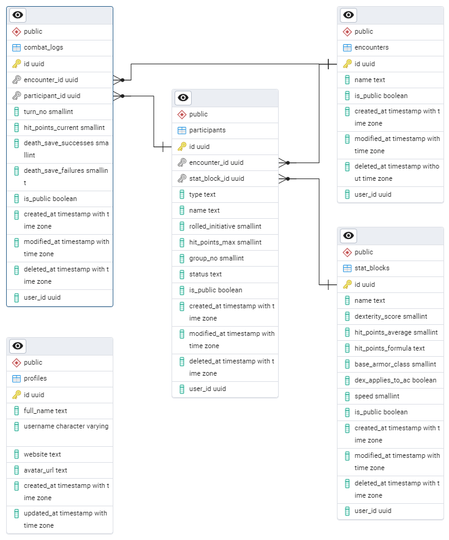

# Database Schema Overview

This document outlines the database structure used in the Advanced Initiative Tracker project.

## Entity-Relationship Diagram (ERD)

---

## Common Fields

The following fields are present in most tables for consistency and audit purposes:

| Field        | Type            | Description                                      |
|--------------|-----------------|--------------------------------------------------|
| `id`         | `uuid`          | Unique identifier, primary key.                 |
| `is_public`  | `boolean`       | Indicates if the record is visible to others.   |
| `created_at` | `timestamp`     | Record creation timestamp.                      |
| `modified_at`| `timestamp`     | Last modification timestamp (nullable).         |
| `deleted_at` | `timestamp`     | Soft deletion timestamp (nullable).             |
| `user_id`    | `uuid`          | User who owns the record (foreign key).         |

---

## Tables

### `encounters`
| Field        | Type            | Description                          |
|--------------|-----------------|--------------------------------------|
| `id`         | `uuid`          | Unique identifier.                   |
| `name`       | `text`          | Name of the encounter.               |
| `is_public`  | `boolean`       | Visibility to others.                |
| `created_at` | `timestamp`     | Timestamp of creation.               |
| `modified_at`| `timestamp`     | Timestamp of last update (nullable). |
| `deleted_at` | `timestamp`     | Timestamp of soft deletion (nullable).|
| `user_id`    | `uuid`          | Owner of the record.                 |

---

### `stat_blocks`
| Field              | Type        | Description                                  |
|--------------------|-------------|----------------------------------------------|
| `id`               | `uuid`      | Unique identifier.                           |
| `name`             | `text`      | Name of the stat block (e.g., "Goblin").     |
| `dexterity_score`  | `smallint`  | Dexterity score used for initiative rolls.   |
| `hit_points_average`| `smallint` | Average HP (nullable).                       |
| `hit_points_formula`| `text`     | Formula to calculate HP (nullable).          |
| `base_armor_class` | `smallint`  | Base armor class value.                      |
| `dex_applies_to_ac`| `boolean`   | Whether DEX modifier applies to armor class. |
| `speed`            | `smallint`  | Movement speed.                              |
| `is_public`        | `boolean`   | Visibility to others.                        |
| `created_at`       | `timestamp` | Timestamp of creation.                       |
| `modified_at`      | `timestamp` | Timestamp of last update (nullable).         |
| `deleted_at`       | `timestamp` | Timestamp of soft deletion (nullable).       |
| `user_id`          | `uuid`      | Owner of the record.                         |

---

### `participants`
| Field        | Type        | Description                              |
|--------------|-------------|------------------------------------------|
| `id`         | `uuid`      | Unique identifier.                       |
| `encounter_id`| `uuid`     | Foreign key referencing `encounters.id`. |
| `stat_block_id`| `uuid`    | Foreign key referencing `stat_blocks.id`.|
| `type`       | `text`      | Participant type (e.g., "Player").       |
| `name`       | `text`      | Participant name.                        |
| `rolled_initiative` | `smallint` | Pre-calculated initiative roll (without DEX modifier). |
| `hit_points_max`| `smallint`| Maximum hit points.                     |
| `group_no`   | `smallint`  | Group number for sorting (nullable).     |
| `status`     | `text`      | Status (e.g., "Alive").                  |
| `is_public`  | `boolean`   | Visibility to others.                    |
| `created_at` | `timestamp` | Timestamp of creation.                   |
| `modified_at`| `timestamp` | Timestamp of last update (nullable).     |
| `deleted_at` | `timestamp` | Timestamp of soft deletion (nullable).   |
| `user_id`    | `uuid`      | Owner of the record.                     |

---

### `combat_logs`
| Field                | Type        | Description                                      |
|----------------------|-------------|--------------------------------------------------|
| `id`                 | `uuid`      | Unique identifier.                               |
| `encounter_id`       | `uuid`      | Foreign key referencing `encounters.id`.         |
| `participant_id`     | `uuid`      | Foreign key referencing `participants.id`.       |
| `round_no`           | `smallint`  | Round number.                                    |
| `hit_points_current` | `smallint`  | Current HP of the participant.                   |
| `death_save_successes`| `smallint` | Number of successful death saving throws.        |
| `death_save_failures`| `smallint`  | Number of failed death saving throws.            |
| `is_public`          | `boolean`   | Visibility to others.                            |
| `created_at`         | `timestamp` | Timestamp of creation.                           |
| `modified_at`        | `timestamp` | Timestamp of last update (nullable).             |
| `deleted_at`         | `timestamp` | Timestamp of soft deletion (nullable).           |
| `user_id`            | `uuid`      | Owner of the record.                             |

---

### `profiles`
| Field         | Type        | Description                |
|---------------|-------------|----------------------------|
| `id`          | `uuid`      | Unique identifier.         |
| `full_name`   | `text`      | User's full name (nullable).|
| `username`    | `varchar`   | User's username (nullable).|
| `website`     | `text`      | User's personal website URL.|
| `avatar_url`  | `text`      | URL to the user's avatar.  |
| `created_at`  | `timestamp` | Timestamp of creation.     |
| `updated_at`  | `timestamp` | Timestamp of last update.  |

---

## Relationships

| Table          | Foreign Key                  | References       | Description                                       |
|----------------|------------------------------|------------------|---------------------------------------------------|
| `participants` | `encounter_id`              | `encounters.id`  | Links participants to their encounter.           |
| `participants` | `stat_block_id`             | `stat_blocks.id` | Links participants to their stat block.          |
| `combat_logs`  | `encounter_id`              | `encounters.id`  | Links combat logs to their encounter.            |
| `combat_logs`  | `participant_id`            | `participants.id`| Links combat logs to their participant.          |

---

For the full database schema, see [schema.sql](./schema.sql).
